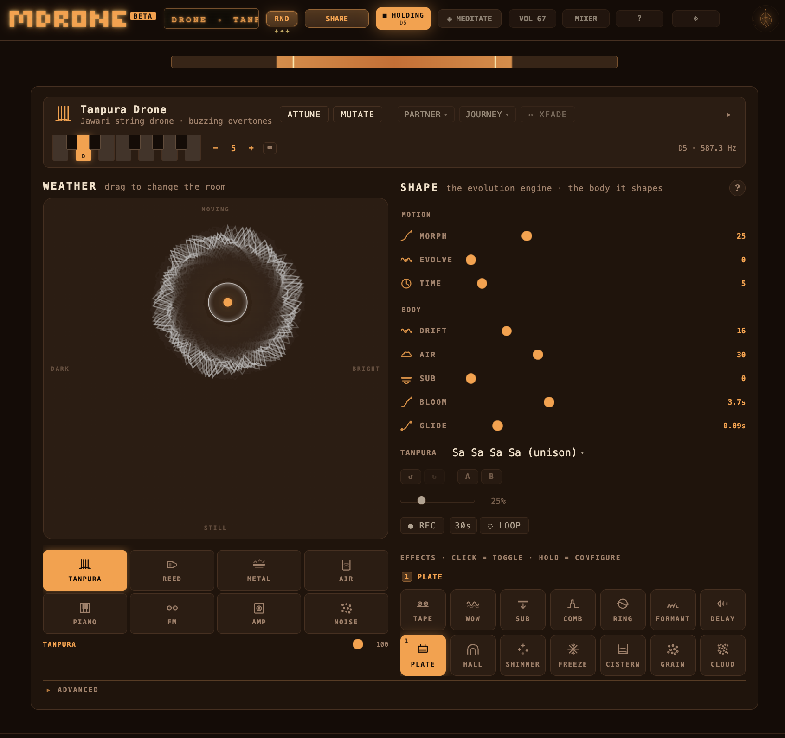

<h1 align="center">mdrone</h1>
<p align="center"><strong>Hold a note. Shape the air. Save the atmosphere.</strong><br><br>A browser drone instrument for long tones, harmonic beds, and slow-moving space.<br>Pick a tonic, build a timbre stack, drift it through weather and effects.<br>No install. No account. Free.</p>

<p align="center">
  <a href="https://mdrone.org/">https://mdrone.org/</a>
</p>

<p align="center">
  
</p>

<p align="center">
  <a href="https://github.com/gdamdam/mdrone"></a>
  <a href="https://github.com/gdamdam/mdrone/blob/main/LICENSE"></a>
  
  
</p>

---

## What it does

- **Holds a drone in the browser** — tonic, mode, timbre layers, climate, and master bus are ready immediately.
- **Shapes sound slowly** — macros, a breathing LFO, and a large XY climate pad for brightness and motion.
- **Builds real texture** — seven authored voice models and a 14-effect chain with worklet-based plate, shimmer, freeze, FDN hall/cistern, and two granular engines.
- **Evolves on its own** — preset morphing, URL-deterministic self-evolution, MUTATE, authored JOURNEYs, sympathetic PARTNER, and recorded gesture replay.
- **Tunes microtonally** — six builtin tunings, a Scale Editor for custom tables, per-interval ±25 ¢ fine detune that retunes voices live.
- **Saves + shares** — named local sessions, share-URL encoding of the full scene + optional recorded gestures + custom tuning, WAV master recording.

No install. No account. No personal tracking. Session data stays in your browser.

---

## Table of Contents

- [Three Views](#three-views)
- [Audio Engine](#audio-engine)
- [Voices](#voices)
- [Effects](#effects)
- [Microtuning](#microtuning)
- [Motion & Evolution](#motion--evolution)
- [Mixer](#mixer)
- [MEDITATE view](#meditate-view)
- [Sessions, Sharing, Recording](#sessions-sharing-recording)
- [Keyboard & MIDI](#keyboard--midi)
- [Interface](#interface)
- [Deployment](#deployment)
- [Project Layout](#project-layout)
- [Privacy](#privacy)
- [License](#license)

---

## Three Views

| View | Purpose |
|---|---|
| **DRONE** | The instrument: header tonic / octave / HOLD transport, preset library, voice stack, macros, breathing LFO, climate XY pad, effect chain, undo/redo + A/B snapshot slots, SCALE editor, GESTURES panel |
| **MEDITATE** | 24 full-screen visualizers grouped GEOMETRIC / SPECTRAL / FIELD / HYPNOTIC, picked from a dropdown (double-click canvas to cycle). Many accrete complexity over minutes rather than react per-frame: PITCH MANDALA, BREATHING MANDALA, HALO & RAYS, SEDIMENT STRATA, TAPE DECAY, and more. Also: a JULIA FRACTAL that reacts to low / mid / high spectral bands, and five original drone-native visualizers (SALT DRIFT, IRON FILINGS, SEDIMENT STRATA, EROSION CONTOURS, ASH TRAIL). |
| **MIXER** | Master bus: HPF, 3-band EQ, glue compression, drive, brickwall limiter with ceiling, SAFE (headphone-safe) toggle, CLIP LED (pre-limiter peak), LUFS-S + PEAK metering, final output trim |

---

## Audio Engine

All sound is synthesised in real time with the Web Audio API. No sample library is required.

- **Voice engine** — AudioWorklet-backed drone voices. Each active layer spawns one worklet voice per interval in the selected mode, mixed through per-layer gains. Tonic changes glide; interval changes rebuild with a short crossfade; BLOOM controls stack fade-in.
- **Climate** — the WEATHER XY pad drives brightness (filter cutoff) on X and motion (LFO depth + drift) on Y. TIME controls the weather LFO rate. A separate user LFO adds breathing/tremolo on voice gain. An optional second modulator — the **LFO 2 · FLICKER** panel — reaches 0.5–45 Hz with AM and per-voice dichotic L/R detune, phase-locked to the breathing LFO (see below).
- **Atmosphere chain** — the dry signal and shimmer octave source feed a **14-effect chain before the master bus**. Effects can run serial (wet-insert) or parallel (send) per preset. The chain order is user-reorderable via drag.
- **Master bus** — HPF, 3-band EQ, glue compression, drive, **worklet brickwall limiter** (post-P1, replaces the native DynamicsCompressor), trim, and analyser taps (pre-limiter for CLIP, post-limiter for LUFS/PEAK).
- **Oversampling** — `tanh` nonlinearities in AMP, TANPURA jawari, METAL, and master drive are 2× oversampled to keep aliasing below the noise floor.
- **Reverbs** — PLATE is a worklet Dattorro plate with paper-accurate taps. HALL and CISTERN are **FDN worklets** (post-P1, replacing the earlier noise-IR convolvers); size + damping tuned per-preset.
- **Recording** — the final post-limiter, post-trim master can be captured and rendered to WAV through `MediaRecorder` + WebM audio when the browser supports both.
- **Determinism** — reverb IRs and evolve drift are seeded from a per-scene PRNG (FNV-1a hash of the preset ID or share-URL seed). Same URL ⇒ same tail, same drift.

---

## Voices

Seven authored voice models with per-voice physicality (jawari nonlinearity, soundboard coupling, bellows AM, modal bowls, cabinet shaping).

| Voice | Character |
|---|---|
| **TANPURA** | Karplus-Strong plucked string with jawari nonlinearity + auto-repluck cycle. Supports classical tunings (unison, Sa-Pa, Sa-Ma, Sa-Ni). |
| **REED** | Harmonium / shruti-box additive reed stack with bellows motion and warm saturation. `shape` selects odd-partial (clarinet) / even-partial (bowed) / balanced (organ) / pure sine. |
| **METAL** | Inharmonic partial cloud with slow 0.08 Hz re-excitation and singing-bowl / bell character. |
| **AIR** | Pink-noise resonator voice for tuned wind, breath, and open-pipe texture. |
| **PIANO** | Long-decay felted sustain layer for soft tonal beds. |
| **FM** | Dual-operator FM voice for metallic drones and bell-like overtones. Slow index LFO (±55% over 30–50 s) keeps DX7-style bells alive. |
| **AMP** | Sustained amp / cabinet drone source with harmonic body. `tanh` drive runs at 2× oversample. |

---

## Effects

The chain holds 14 effects. Each is a toggle (click) with a long-press settings modal (AMOUNT + effect-specific params). Order is user-reorderable via drag.

| Effect | Character |
|---|---|
| **TAPE** | Saturation, head bump, top-end rolloff |
| **WOW** | Slow wow plus faster flutter on a short delay line |
| **SUB** | True octave-down subharmonic — triangle at root/2, amplitude-tracked, summed in parallel |
| **COMB** | Root-tracking resonant comb filter with soft-clipped feedback |
| **DELAY** | Warm feedback delay with lowpass and saturation in the loop |
| **PLATE** | Worklet Dattorro plate reverb |
| **HALL** | Worklet FDN hall (size ≈ 0.45, bright damping) |
| **SHIMMER** | Worklet shimmer reverb plus octave-up source voice |
| **FREEZE** | Worklet freeze capture that latches a sustained layer |
| **CISTERN** | Worklet FDN cathedral-scale reverb (size ≈ 1.2, dark damping, ~28 s tail) |
| **GRANULAR** | Drone-smooth grain cloud — medium grains at moderate density, trapezoid envelope, per-channel envelope-sum normalised |
| **GRAINCLOUD** | Classic grain stutter — 40 ms grains at 25/s, falling-exponential envelope, ordered time-stretch replay, pitches snapped to the drone scale |
| **RINGMOD** | Ring modulator for inharmonic shimmer and bell-like sidebands |
| **FORMANT** | Parallel band-pass vowel formant body (rewrite in 1.9.0; previous serial-peaking stack was ~20 dB hot in midrange) |

AIR controls the reverb-family wet return. Both HALL and CISTERN can be routed serially (wet-insert) or parallel (send) per preset; serial routing adds a make-up gain trim so minimal presets don't sit lower than layered ones.

---

## Microtuning

- **6 builtin tuning tables**: equal (12-TET), just 5-limit, ¼-comma meantone, harmonic series, maqam rast, slendro.
- **6 relation presets**: unison, tonic-fifth, tonic-fourth, minor triad, drone triad, harmonic stack.
- **Per-interval ±25 ¢ fine detune** that retunes voices live.
- **Scale Editor** (✎ next to the tuning picker in the SHAPE panel) — author a 13-degree tuning table in cents, save to `localStorage`, apply as active. Custom tunings travel with share URLs so recipients hear the authored pitch grid, not a silent fallback to equal.
- **11 mode scales** (when not in microtonal mode): drone, major, minor, dorian, phrygian, just 5-limit, pentatonic, meantone, harmonics, maqam-rast, slendro.

---

## Motion & Evolution

The instrument has five motion/evolution systems arranged by timescale. MORPH and EVOLVE are continuous macros; the GESTURES panel (disclosed in the SHAPE column) holds the on-demand and scripted ones.

| System | Timescale | What it does |
|---|---|---|
| **MORPH** | seconds | Controls how slowly the drone cross-fades when you load another preset. 0 = snap, 1 = ~20 s glacial fade. |
| **EVOLVE** | minutes | Continuous macro drift while a preset is held. 0 = dead-still, 1 = active drift. URL-seeded — same share URL ⇒ same arc. |
| **MUTATE** | instant | One-shot random perturbation of macros / voice mix / effect levels by the intensity slider. Fires once per click. URL-seeded. |
| **JOURNEY** | ~20 min | Authored 4-phase ritual: arrival → bloom → suspension → dissolve. Replaces EVOLVE drift while active. Four shipped: morning, evening, dusk, void. URL-seeded. |
| **REC MOTION** | 60 s / 200 events | Captures live tonic / octave / macro / climate / LFO moves into the next share URL. On load, replays deterministically against the starting scene. Opt-in: enable in Settings → Advanced. |

**PARTNER** adds a sympathetic second voice layer at a fixed musical relation (fifth, octave-up, octave-down, +7 ¢ beat-detune). It's a voicing control, not a motion gesture — doubles voice count while active.

**Undo / redo + A/B slots** (SHAPE panel): a 50-entry debounced history of scene state. `Cmd/Ctrl+Z` undoes, `Cmd/Ctrl+Shift+Z` redoes. Two A/B slots (SAVE A / A recall / SAVE B / B recall) for compare-and-return workflows.

---

## LFO 2 · FLICKER

A second amplitude modulator inside the ADVANCED disclosure, covering **0.5 Hz → 45 Hz**. Integer-phase-locked to the breathing LFO (LFO 1) so the two modulators never drift against each other.

- **● ON / OFF** — power button. Off by default; the subtitle still describes the current state, prefixed `(off)`.
- **Rate slider** — zone-coloured gradient (δ delta / θ theta / α alpha / β beta / γ gamma) with tappable landmark ticks at 2 / 6 / 10 / 20 / 40 Hz and a dashed 7.83 Hz "Schumann" marker.
- **AM** — sums a second oscillator into the voice-gain param. Works on speakers. Slow rates sound like a swell, mid rates like tremolo, upper rates like metallic roughness.
- **DICHOTIC** — splits L/R pitch per voice by the SPREAD cents (applied to reed / metal / piano / fm / amp / tanpura). Headphones required for the phantom beat to fuse in the head.
- **BOTH** — both paths active.
- The subtitle rewrites live: e.g. `alpha-band pulse at 10.00 Hz · locked ×25 to breathing` or `L/R detune ±4.0 ¢ — headphones · locked ×25 to breathing`.

It's a second modulator in the tradition of Scelsi, Niblock and Radigue — drone pieces built on beating and slow amplitude changes.

---

## Mixer

Master-bus controls matched to the mpump / mloop family vocabulary:

- **HPF** with quick OFF / 20 / 30 / 40 Hz stepping
- **3-band EQ** (low, mid, high)
- **GLUE** — soft compressor amount
- **DRIVE** — soft-clip waveshaper (`tanh`, 2× oversample via LUT)
- **LIMITER** — worklet brickwall with ceiling control and release
- **SAFE** — headphone-safe mode, clamps outputTrim to −6 dBFS
- **CLIP LED** — taps the **pre-limiter** signal so it reports input overshoot, not the brickwall holding its ceiling
- **LUFS-S + PEAK** — EBU R128 K-weighted short-term (3 s window) loudness + sample-peak readout, updated ~30 Hz
- **VOL** — final output trim

---

## MEDITATE view

24 authored visualizers organised into four groups in the picker:

- **GEOMETRIC** — breathing mandala, pitch mandala, flow field, waveform ring, sigil bloom, cymatics
- **SPECTRAL** — aurora, spectral waterfall, sediment strata, erosion contours
- **FIELD / PAINTERLY** — Rothko field, tape decay, Dream House magenta, ink bloom, halo & rays, horizon sunrise, resonant orb, salt drift, iron filings, ash trail
- **HYPNOTIC** — feedback tunnel, star gate, Julia fractal, dream machine *(10 Hz flicker — warning shown; close eyes for the classic usage)*

Most visualizers follow a drone-native ethos: slow time, heavy / matte material, no glow or hue-from-audio, no per-frame fast reactivity. They **accrete over minutes** rather than react per-frame — PITCH MANDALA accrues pitch-class presence through a long integrator, BREATHING MANDALA and HALO & RAYS add new ornament tiers at growth > 0.3 / 0.5 / 0.7 / 0.85, SEDIMENT STRATA deposits rock layers at the bottom and the pile grows upward, TAPE DECAY scars its loop every pass, SALT DRIFT piles dunes at the bottom of the frame.

JULIA FRACTAL is the one deliberate exception — it reacts to the *kind* of drone: low-band energy warps the Julia cr parameter, high-band warps ci, mid-band pulses zoom, overall RMS scales rotation. Rich spectra push the fractal toward the Mandelbrot rim where the shape morphs dramatically; a pure tonic sits quietly.

HALO & RAYS similarly reads the spectrum by thirds: low feeds the bass swell ring and background glow, mid feeds the flame ring radius and fire tongues, high drives spark density and ember count. Spectral centroid tilts the palette ±20° (bass-dominant → red, treble → gold).

Dropdown in the toolbar picks the active visualizer; **double-click the canvas** to cycle through. Fullscreen via the ⛶ button, pop-out to a second window via ↗ POP OUT, random-scene without leaving the visualizer via 🎲 RND.

---

## Sessions, Sharing, Recording

**Sessions** are named local saves in `localStorage`. Save / Load / Rename from the Settings modal.

A saved session includes the active preset, tonic / octave / mode, microtuning + relation + fine detune offsets, voice layers + levels, macros, climate, LFO, LFO 2 / FLICKER state (power + rate + mode + dichotic spread), effect toggles + per-effect levels, effect chain order, mixer, evolve seed, journey, partner, and the optional motion recording.

**Share URLs** build a compressed scene encoding of everything above. URLs are backward compatible — older URLs missing newer fields load with sensible defaults. Custom tunings travel with the URL so the receiver hears the authored tuning, not equal.

**Recording** captures the final master output to a **24-bit stereo WAV** via a dedicated AudioWorklet tap. Samples are bit-identical to what the engine produced — no intermediate codec. Memory cost is ~44 MB per 10 minutes at 48 kHz, so render long sessions in shorter passes.

---

## Keyboard & MIDI

### Keyboard shortcuts

| Key | Action |
|---|---|
| `A W S E D F T G Y H U J` | Tonic (C C# D D# E F F# G G# A A# B) |
| `Z` / `X` | Octave down / up |
| `Space` | HOLD toggle |
| `Cmd/Ctrl+Z` | Undo |
| `Cmd/Ctrl+Shift+Z` | Redo |
| `<` / `>` | Previous / next preset in group |

QWERTY tonic requires the ⌨ button enabled in the SHAPE column.

### MIDI

Web MIDI note-in retunes tonic + octave from external hardware. CC mapping with learn mode: click a target, move a knob to assign.

**~46 assignable targets** organised into groups that mirror the instrument:

| Group | Targets |
|---|---|
| Macros | DRIFT, AIR, TIME, SUB, BLOOM, GLIDE, MORPH, EVOLVE, PLUCK |
| Weather | WEATHER X, WEATHER Y, LFO RATE, LFO DEPTH |
| Mixer | VOL, HPF, EQ LOW / MID / HIGH, GLUE, DRIVE, CEILING |
| Voices | TANPURA, REED, METAL, AIR VX, PIANO, FM, AMP |
| Effects | TAPE, WOW, SUB (fx), COMB, DELAY, PLATE, HALL, SHIMMER, FREEZE, CISTERN, GRANULAR, GRAINCLOUD, RINGMOD, FORMANT |
| Triggers | HOLD, PANIC, RND, MUTATE (fire on rising edge ≥ 64; HOLD follows sustain-pedal state) |
| Presets | PRESET ◀ / ▶ (prev/next across the whole library), GROUP ◀ / ▶ (prev/next within the current group) — map four pads and walk the preset library live |

Defaults:

| CC | Default target |
|---|---|
| CC1 (mod wheel) | WEATHER Y |
| CC2 (breath) | WEATHER X |
| CC7 (volume) | VOL |
| CC64 (sustain) | HOLD |
| CC71–76 | DRIFT, AIR, TIME, BLOOM, GLIDE, SUB |

Every other target is unassigned by default — learn to bind.

### Tempo sync (Ableton Link)

mdrone has no transport clock (drones aren't timed), but the breathing LFO RATE now syncs to Ableton Link tempo. A small chip next to RATE cycles through **FREE / 1/1 / 1/2 / 1/4 / 1/8 / 1/16**; any non-FREE mode locks one LFO cycle to that note value at the Link session tempo. The macro slider becomes read-only while locked and follows tempo changes in real time.

mdrone reuses mpump's Link Bridge — a tiny cross-platform companion that bridges Ableton Link (UDP multicast) ↔ browser (WebSocket on localhost). Download once, works for both instruments.

1. **Download**: [github.com/gdamdam/mpump/releases](https://github.com/gdamdam/mpump/releases) — macOS / Windows / Linux binaries, ~5 MB
2. **Run** the bridge app (Tauri, opens a small always-on-top window)
3. **Enable** Ableton Link in mdrone → Settings → ABLETON LINK
4. Open Ableton Live (or any Link-enabled app) — tempo syncs automatically

Auto-detect also runs at page load — if the bridge is already running, mdrone attaches silently. Nothing leaves your machine: the bridge only makes local UDP (peer discovery on LAN) and localhost WebSocket connections.

Tanpura PLUCK sync is deferred — the current scheduling is randomized "every 5–7 seconds per string / rate" which doesn't map cleanly to beats. A bar-locked variant is future work.

---

## Interface

- 4 palettes: 3 warm dark (Ember, Copper, Dusk) + 1 light (Parchment, for bright rooms / stages)
- Responsive two-column layout that collapses for smaller screens
- Sticky header with transport, tonic, RND, session, recording, and MIDI access
- `docs/parameters.md` — auto-generated parameter reference (regenerate via `npm run docs:params`)

---

## Deployment

GitHub Pages deploy via the `gh-pages` package:

```bash
npm run deploy
```

That builds the app and publishes `dist/` to the `gh-pages` branch.

---

## Project Layout

```text
mdrone/
  public/
    about.html          # explainer / SEO page
    robots.txt          # allow search crawlers, block selected AI crawlers
    sitemap.xml         # crawlable URLs for search engines
  src/
    components/         # React UI — drone, meditate, mixer, header, footer, modals
    engine/             # Audio engine, voice builder, FX chain, worklet processors, presets, MIDI
    scene/              # Scene manager, scene model, snapshot/share plumbing
    styles/             # Global CSS
    microtuning.ts      # Tuning tables + custom-tuning registry
    App.tsx             # Singleton engine bootstrap + theme init
    config.ts           # App version + storage keys
    session.ts          # Saved session types + browser persistence helpers
    themes.ts           # Palette definitions and theme application
    types.ts            # Shared app types
  scripts/
    build-worklet.mjs       # Concatenates voice modules into droneVoiceProcessor.js
    build-parameters-doc.mjs # Regenerates docs/parameters.md
    write-version-json.mjs  # Writes public/version.json for the footer
  tests/                # node:test suites — codec, sessions, presets, DSP smoke
```

---

## Privacy

mdrone does not use accounts, cookies, ads, or personal tracking.

### Anonymous page counts

mdrone uses [GoatCounter](https://goatcounter.com) for anonymous, cookieless page-view counting. GoatCounter does not collect personal data, does not use cookies, and does not track across sites.

### What mdrone does not collect

- **No accounts** — no sign-up, email, or profile
- **No cookies** — no login, ad, or tracking cookies
- **No user IDs** — no persistent personal identifier
- **No fingerprinting** — no device/browser identity
- **No ad networks** — no third-party ad or surveillance trackers

### What stays local

- **Sessions** — `localStorage` on your device
- **Audio** — synthesised locally via Web Audio and AudioWorklet
- **Recordings** — rendered and downloaded locally
- **Custom tunings** — `localStorage`
- **Open source** — full codebase on [GitHub](https://github.com/gdamdam/mdrone)

### Hosting

mdrone is hosted on [GitHub Pages](https://pages.github.com). Normal search crawlers are allowed via `robots.txt`; known AI training crawlers are blocked (`GPTBot`, `Google-Extended`, `ClaudeBot`, `anthropic-ai`, `PerplexityBot`, `CCBot`, `Bytespider`, `Amazonbot`, `Applebot-Extended`, `cohere-ai`, `Meta-ExternalAgent`). The sitemap advertises the public explainer at `/about.html`.

Your drone stays on your device. Always.

---

## License

[AGPL-3.0](LICENSE)

## Trademark

"mdrone" is an unregistered trademark of the author. Use of the name or logo for derivative projects or services may cause confusion and is not permitted.

---

Built with Claude Code. Design, architecture, UX, audio chain, and creative direction by [gdamdam](https://github.com/gdamdam).
